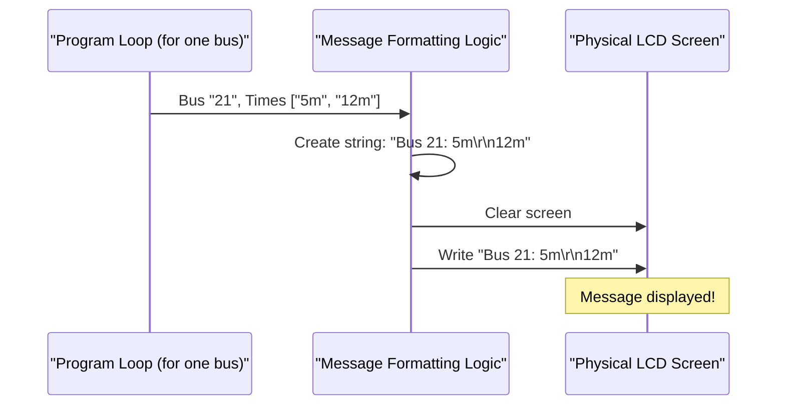

# Chapter 1: LCD Data Presenter

Welcome to the first chapter of our journey into the `raspberry-pi-bus-timing-in-lcd` project! We're going to build a cool device that shows you when the next bus is arriving, right on a small screen.

Today, we'll explore a key part of this project: the **LCD Data Presenter**.

## What's an LCD Data Presenter?

Imagine you're a newspaper editor. You have lots of information (bus arrival times), but you need to print it in a very small space – a tiny 16x2 LCD screen. That's a screen with just 2 lines, and each line can only fit 16 characters!

The **LCD Data Presenter** is like that newspaper editor. Its job is to:
*   Take the processed bus arrival information.
*   Decide how to best display it clearly and concisely on the small screen.
*   Format this information into short text strings.
*   Handle line breaks (e.g., bus number on line 1, timings on line 2).
*   Clear away old information from the screen.
*   Tell the LCD screen exactly what text to write.

The goal is simple: make the bus arrival messages easy to read and understand at a glance.

Let's say we know that bus number "7" is arriving in "5 minutes" and then "12 minutes". How do we show this on our tiny screen? That's the puzzle the LCD Data Presenter solves!

## Our Tiny Stage: The 16x2 LCD

The LCD screen we're using is a common type called a "16x2 Character LCD".
*   **16x2** means it has **2 rows** (lines).
*   Each row can display up to **16 characters** (letters, numbers, symbols).

Here's a visual:

```
+----------------+
|Line 1: 16 chars|
|Line 2: 16 chars|
+----------------+
```

This limited space is a big challenge! We can't just write long sentences. We need to be clever and pick only the most important information, formatting it perfectly.

## The Presenter's Job: Making Sense of Data

The LCD Data Presenter receives information that looks something like this (this data is fetched and processed by other parts of our project, like the [Datamall API Client](04_datamall_api_client_.md) and [API Response Processor](05_api_response_processor_.md), which we'll learn about later):

*   Bus Number: "Svc 21" (for bus service 21)
*   Arrival Times: `["3 min", "10 min", "18 min"]` (a list of the next three arrival estimates)

The Presenter then thinks:
1.  **How many arrival times do I have?** Zero? One? Two? Three?
2.  **Based on that, what's the best message?**
    *   If there are no timings, maybe show "NOT AVAILABLE".
    *   If there's only one, maybe it's the "LAST BUS".
    *   If there are a couple, show them!
3.  **How do I fit this into two short lines?**
    *   Typically, Line 1: Bus number and the first arrival time.
    *   Typically, Line 2: Subsequent arrival times or a special message.

## Crafting the Message: A Look at the Code

In our `main.py` file, a part of the code acts as our LCD Data Presenter. Let's look at how it decides what to display for each bus service.

The program first gets a list of all buses and their timings for our chosen bus stop. Then, it loops through each bus service one by one:

```python
# buses is a dictionary like: {'21': ['3m', '10m', '18m'], '168': ['5m', '12m']}
# We'll look at one bus at a time from this 'buses' data.
for bus_num, bus_timings in buses.items():
    display_string = '' # This will hold the final message for the LCD
    # ... decision logic comes next ...
```
This loop takes each `bus_num` (like "21") and its `bus_timings` (like `['3m', '10m', '18m']`) and prepares a `display_string`.

Now, let's see how `display_string` is created based on the number of available `bus_timings`.

### Case 1: No Timings Available

If a bus service has no upcoming arrival times (e.g., it's not running at the moment), `bus_timings` will be an empty list.

```python
    # What if there are no arrival times?
    if len(bus_timings) == 0:
        display_string = f"Bus {bus_num}: NOT\r\nAVAILABLE"
```
*   `len(bus_timings)` checks how many items are in the `bus_timings` list. If it's `0`, this condition is true.
*   `f"Bus {bus_num}: NOT\r\nAVAILABLE"` is an "f-string". It's a way to easily put variables like `bus_num` into a string.
*   `\r\n` is special: `\r` (carriage return) moves the cursor to the beginning of the current line, and `\n` (newline) moves it to the next line. Together, they create a line break.

So, if `bus_num` is "21" and there are no timings, the LCD would show:
```
Bus 21: NOT
AVAILABLE
```

### Case 2: Only One Arrival Time

If there's only one arrival time, it might be the last bus for the day.

```python
    # What if there's only one arrival time?
    if len(bus_timings) == 1:
        display_string = f"Bus {bus_num}: {bus_timings[0]}\r\nLAST BUS"
```
*   `bus_timings[0]` gets the first (and only) item from the `bus_timings` list.

If `bus_num` is "21" and `bus_timings` is `["25 min"]`, the LCD would show:
```
Bus 21: 25 min
LAST BUS
```

### Case 3: Two Arrival Times

This is a common scenario, showing the next two buses.

```python
    # What if there are two arrival times?
    if len(bus_timings) == 2:
        display_string = f"Bus {bus_num}: {bus_timings[0]}\r\n{bus_timings[1]}"
```
*   `bus_timings[0]` is the first arrival time.
*   `bus_timings[1]` is the second arrival time.

If `bus_num` is "21" and `bus_timings` is `["5 min", "12 min"]`, the LCD would show:
```
Bus 21: 5 min
12 min
```

### Case 4: Three Arrival Times

Our project tries to show up to three arrival times. Here's how the code handles it:

```python
    # What if there are three (or more) arrival times?
    if len(bus_timings) == 3:            
        display_string = f"Bus {bus_num}: {bus_timings[0]}\r\n{bus_timings[1]}, {bus_timings[1]}"
```
*   Line 1 shows the bus number and the first arrival time (`bus_timings[0]`).
*   Line 2 shows the second arrival time (`bus_timings[1]`), followed by a comma, and then... the second arrival time *again* (`bus_timings[1]`).

This is an interesting detail from the provided code! If `bus_num` is "21" and `bus_timings` is `["2m", "8m", "15m"]`, the LCD would show:
```
Bus 21: 2m
8m, 8m
```
It shows the first timing on line 1, and the second timing twice on line 2. This ensures the message fits and still gives useful info. (The third timing, "15m", isn't displayed in this specific version).

## Showing it on Screen: Clear and Write

Once the `display_string` is ready, we need to put it on the LCD.

```python
            # lcd is our object for controlling the LCD screen
            lcd.clear() # Clears anything currently on the screen
            time.sleep(1) # Pause for 1 second to make the change visible
            lcd.write_string(display_string) # Write our new message
            time.sleep(5) # Keep this message on screen for 5 seconds
```
1.  `lcd.clear()`: Imagine wiping a small whiteboard clean before writing something new. This function does exactly that for our LCD.
2.  `time.sleep(1)`: This tells the program to pause for 1 second. It's a tiny pause, but it helps our eyes notice that the screen has been updated, especially if the information changes quickly.
3.  `lcd.write_string(display_string)`: This is the magic moment! It sends our carefully formatted `display_string` to the LCD, and the text appears. We'll learn more about how this command talks to the actual hardware in the [Physical Display Interface](02_physical_display_interface_.md) chapter.
4.  `time.sleep(5)`: The program pauses for 5 seconds, keeping the current bus information visible before it moves on to show information for the next bus service (if any) or refresh the data.

The whole process of getting data, formatting it, and showing it repeats. This is managed by what we can call the [Continuous Update Orchestrator](03_continuous_update_orchestrator_.md), ensuring the display stays up-to-date.

## The Whole Process: A Quick Sketch

Let's visualize the LCD Data Presenter's role in showing information for *one* bus:


This flow happens for each bus service your Raspberry Pi needs to display.

## Summary and What's Next

Phew! We've just learned about the **LCD Data Presenter**. It's the part of our program that acts like a skilled editor, taking bus arrival data and carefully formatting it to be displayed clearly on our small 16x2 LCD screen. It handles different scenarios for arrival times and makes sure each message is concise and readable.

We saw how it:
*   Chooses what information to show based on how many arrival times are available.
*   Uses f-strings and `\r\n` to format messages across two lines.
*   Clears the screen before writing new information.
*   Writes the final string to the LCD.

But how does `lcd.write_string()` actually make text appear on the physical screen? What are `pin_rs`, `pin_e`, and `pins_data` that you might see elsewhere in the code? We'll dive into that in our next chapter: [Physical Display Interface](02_physical_display_interface_.md). See you there!

---

Generated by [AI Codebase Knowledge Builder](https://github.com/The-Pocket/Tutorial-Codebase-Knowledge)