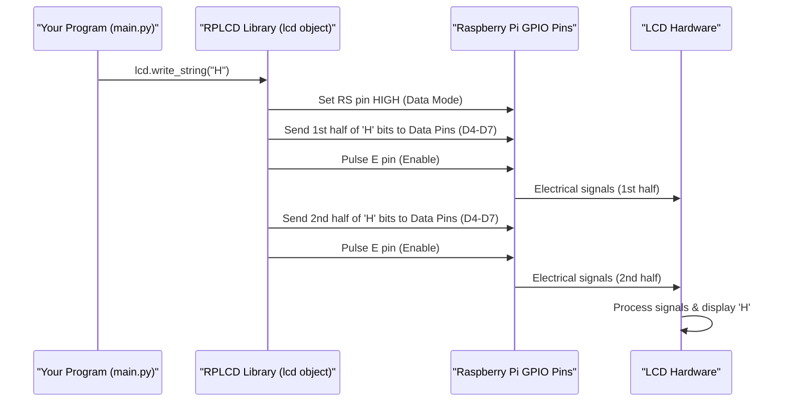

# Chapter 2: Physical Display Interface

Welcome back! In [Chapter 1: LCD Data Presenter](01_lcd_data_presenter_.md), we learned how our program cleverly formats bus arrival times into short messages perfect for our small LCD screen. We saw commands like `lcd.write_string("Bus 21: 5m\r\n12m")`. But how does that command actually make text appear on the physical, glowing LCD screen connected to your Raspberry Pi?

That's exactly what we'll explore in this chapter: the **Physical Display Interface**.

## What's a Physical Display Interface?

Imagine you have a new printer for your computer. You can't just plug it in and expect it to work magically. You need two things:
1.  The correct **cable** (the physical connection).
2.  The correct **driver software** (to tell the computer how to "talk" to this specific printer).

The **Physical Display Interface** for our LCD screen is very similar. It's the bridge between our Python software program and the actual LCD hardware. It involves:
*   **Physical Connections:** Knowing which wires go from the Raspberry Pi's pins to the LCD's pins.
*   **Software Configuration:** Telling our program *which* Raspberry Pi pins are connected to *which* specific control and data pins on the LCD.

Think of it as a special adapter plug combined with driver software. It ensures that the electrical signals sent by the Raspberry Pi are correctly understood by the LCD, so it can display the characters we want. Without this interface, our `lcd.write_string()` command would be like shouting into the void – the LCD wouldn't understand a thing!

The main problem this interface solves is: **How do we translate software commands into physical actions on the LCD screen?**

## The Key Players: GPIO Pins and LCD Pins

To understand this interface, we need to know about two sets of "pins":

### 1. Raspberry Pi GPIO Pins

Your Raspberry Pi has a row of pins called **GPIO** pins. GPIO stands for **G**eneral **P**urpose **I**nput/**O**utput.
*   **General Purpose:** They aren't designed for just one task; we can use them for many things.
*   **Input/Output:** We can use them to send signals *out* (like turning an LED on) or receive signals *in* (like reading a button press).

Think of them as little electronic switches or messengers that our Python program can control.

```
+------------------------+
| o o o o o o o o o o o  |  <-- GPIO Pins on the Raspberry Pi
| o o o o o o o o o o o  |
+------------------------+
```

### 2. LCD Pins

Our 16x2 LCD screen also has its own set of pins. These pins are designed for specific jobs to control the display:

*   `RS` (Register Select): This pin tells the LCD whether we're sending it a **command** (like "clear the screen" or "move the cursor") or **data** (like the letter 'A' or the number '5').
*   `E` (Enable): This pin is like an "Enter" key. When we've set up the other pins with a command or data, we "pulse" this `E` pin to tell the LCD: "Okay, read what I've sent you now!"
*   `Data Pins` (D0-D7): These pins carry the actual information for the characters. For many common LCDs, including ours, we can use them in "4-bit mode," meaning we only need to connect four of these (typically `D4`, `D5`, `D6`, `D7`). This saves us some GPIO pins on the Pi!
*   Other pins: There are also pins for power (VCC, GND), contrast (VO), and backlight (LED+/LED-), but for the *interface* itself, RS, E, and the Data pins are crucial.

```
+-----------------+
| LCD Screen      |
|                 |  [RS] [E] [D4] [D5] [D6] [D7] ...  <-- Pins on the LCD
+-----------------+
```

The Physical Display Interface relies on us physically wiring the correct GPIO pins from the Raspberry Pi to these specific pins on the LCD. (Don't worry, the project guide will show you how to do the wiring!).

## Telling the Software About the Connections: Initialization

Once the wires are connected, we need to tell our Python program *how* they're connected. This is the "software configuration" part of our interface. In our `main.py` script, this happens with one important line of code:

```python
# From main.py
lcd = CharLCD(cols=16, rows=2, pin_rs=37, pin_e=35, pins_data=[33, 31, 29, 23], numbering_mode=GPIO.BOARD)
```

Let's break this down:
*   `CharLCD(...)`: This is us creating an "object" from a special library called `RPLCD.CharLCD`. This object, which we're naming `lcd`, *is* our Physical Display Interface. It knows how to talk to character LCDs.
*   `cols=16, rows=2`: We're telling the library that our LCD has 16 columns (characters per line) and 2 rows. This helps it manage cursor positions and line breaks.
*   `pin_rs=37`: This says, "The LCD's **RS** pin is connected to the Raspberry Pi's physical pin number **37**."
*   `pin_e=35`: This says, "The LCD's **E** (Enable) pin is connected to the Raspberry Pi's physical pin number **35**."
*   `pins_data=[33, 31, 29, 23]`: This tells the library about our 4 data lines.
    *   "The LCD's D4 pin is connected to Pi's pin 33."
    *   "The LCD's D5 pin is connected to Pi's pin 31."
    *   "The LCD's D6 pin is connected to Pi's pin 29."
    *   "The LCD's D7 pin is connected to Pi's pin 23."
    *   (The order matters here!)
*   `numbering_mode=GPIO.BOARD`: This specifies *how* we're identifying the Pi's pins. `GPIO.BOARD` means we're using the physical pin numbers printed on the Raspberry Pi's board (1, 2, 3, ... 40). The alternative is `GPIO.BCM`, which uses the "Broadcom chip" numbering, but `GPIO.BOARD` is often easier for beginners.

**Input:** The pin numbers and LCD dimensions.
**Output:** An `lcd` object that is now configured to control our specific LCD through the specified GPIO pins.

This single line of code is the magic! It sets up the bridge. Now, when we use `lcd.write_string()`, the `lcd` object knows exactly which GPIO pins on the Raspberry Pi to toggle to send the correct electrical signals to the LCD's RS, E, and Data pins.

## Under the Hood: How `lcd.write_string("Hi")` Works

So, what happens when you call `lcd.write_string("Hi")` after the initialization? The `RPLCD` library (our `lcd` object) takes over and does a lot of low-level work:

1.  **Break Down the String:** The library looks at the string "Hi". It will process it one character at a time: first 'H', then 'i'.

2.  **Sending the Character 'H':**
    *   **Set to Data Mode:** The library tells the Raspberry Pi to set the GPIO pin connected to the LCD's `RS` pin to HIGH. This signals to the LCD: "Get ready, character data is coming!"
    *   **Convert 'H' to Binary:** The character 'H' has a numerical representation (ASCII code 72). This is converted into a binary pattern (e.g., `01001000`).
    *   **Send Data (4-bit mode is a bit more complex):** In 4-bit mode, this binary pattern is sent in two halves:
        *   First half (e.g., `0100`): The library sets the Pi's GPIO pins connected to `D7-D4` to the corresponding HIGH/LOW states for `0100`.
        *   **Pulse Enable Pin:** The library briefly toggles the GPIO pin connected to the LCD's `E` pin (HIGH then LOW). This tells the LCD, "Read the data on D7-D4 now!"
        *   Second half (e.g., `1000`): The library sets the Pi's GPIO pins for `D7-D4` to the pattern for `1000`.
        *   **Pulse Enable Pin Again:** The `E` pin is pulsed again. The LCD now has received the full byte for 'H'.
    *   The LCD processes these signals and displays the character 'H' at the current cursor position.

3.  **Sending the Character 'i':** The same process (steps 2a-2d) repeats for the character 'i'.

Commands like `lcd.clear()` work similarly, but the `RS` pin would be set LOW (for command mode), and a specific command code (not a character code) would be sent via the data pins.

Let's visualize this with a simplified sequence:



Thankfully, the `RPLCD` library handles all these tiny, precise electrical steps for us! We just need to tell it *which pins to use* during initialization, and then we can use simple commands like `write_string` and `clear`.

## Analogy Revisited: The Telegraph Operator

Think of our Physical Display Interface (`lcd` object) as a skilled telegraph operator.
*   Our Python program (`main.py`) writes a message (e.g., "Bus 21: 5m").
*   It hands this message to the telegraph operator (our `lcd` object).
*   The initialization `lcd = CharLCD(...)` was like telling the operator which specific telegraph machine to use (which wires are connected to which GPIO pins).
*   The operator knows Morse code (the LCD's electrical language).
*   When `lcd.write_string()` is called, the operator expertly taps out the message in Morse code using the telegraph key (toggling the Raspberry Pi's GPIO pins).
*   The receiving station (the LCD screen) decodes the Morse code and displays the message.

## Summary and What's Next

We've now seen that the **Physical Display Interface** is the crucial link that turns our software's text into visible characters on the LCD. It's all about:
1.  **Connecting** the Raspberry Pi's GPIO pins to the LCD's control and data pins.
2.  **Initializing** the `CharLCD` object in our code, telling it exactly which Pi pins are connected to which LCD pins (e.g., `pin_rs=37`, `pins_data=[33, 31, 29, 23]`).

This interface, primarily the `lcd` object created by `CharLCD(...)`, handles the complex job of sending precise electrical signals through the GPIO pins to control the LCD. It's the "driver" that lets our high-level Python commands interact with the low-level hardware.

So far:
*   We know how to format messages for the LCD ([LCD Data Presenter](01_lcd_data_presenter_.md)).
*   We know how those messages get from our program to the physical screen ([Physical Display Interface](02_physical_display_interface_.md)).

But how do we make sure the bus timings on the screen stay fresh and update automatically? We don't want to see the same "5 min" estimate forever! In the next chapter, we'll explore the [Continuous Update Orchestrator](03_continuous_update_orchestrator_.md), which manages fetching new data and refreshing the display regularly. See you there!

---

Generated by [AI Codebase Knowledge Builder](https://github.com/The-Pocket/Tutorial-Codebase-Knowledge)