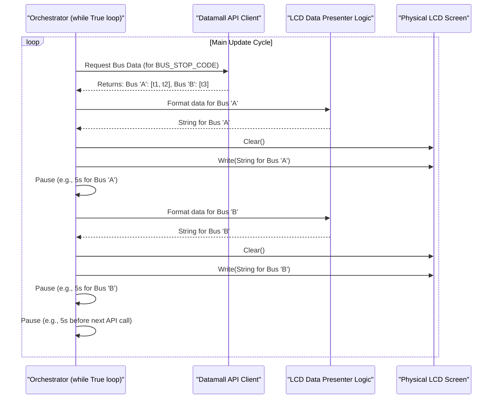

# Chapter 3: Continuous Update Orchestrator

Welcome to Chapter 3! In the previous chapters, we learned how the [LCD Data Presenter](01_lcd_data_presenter_.md) formats messages for our tiny screen, and how the [Physical Display Interface](02_physical_display_interface_.md) actually makes text appear on the LCD.

But how do we make sure the bus arrival times are always up-to-date? We don't want to see "Bus 21: 5 min" forever if the bus is getting closer or has already passed! We need something that keeps refreshing the information. That's where the **Continuous Update Orchestrator** comes in.

## What's a Continuous Update Orchestrator?

Imagine you're managing a train station. You have a big departure board showing train times. It's your job to:
1.  Constantly check for the latest train schedules.
2.  Update the board with any new information.
3.  Make sure each train's information is displayed clearly.
4.  Do this over and over, all day long.

The **Continuous Update Orchestrator** in our project is like this station manager. It's the heart of our application, running a never-ending cycle to keep the bus timings fresh.

Its main jobs are:
*   To tell the **[Datamall API Client](04_datamall_api_client_.md)** (our information source) to fetch new bus arrival data at regular intervals.
*   For each bus service arriving at our stop, to take this fresh data and give it to the **[LCD Data Presenter](01_lcd_data_presenter_.md)** logic to format it.
*   To then get the formatted message displayed on the screen using the **[Physical Display Interface](02_physical_display_interface_.md)**.
*   To manage short pauses between displaying different bus services and longer pauses between full data refreshes. This controls how often we ask for new data (we don't want to overload the API!) and how quickly the display cycles.

Essentially, it solves the problem: **How do we make our bus display a live, automatically updating system?**

## The Never-Ending Show: The Main Loop

The core of the Continuous Update Orchestrator is a loop that, in theory, runs forever (or as long as our program is on). In Python, this is often done with a `while True:` loop.

Let's look at the `main.py` file to see how this orchestrator works. The orchestrator isn't a separate named function here; it's the main logic flow within the `main()` function itself, especially the `while True:` loop.

```python
# Inside main.py, within the main() function
def main(BUS_STOP_CODE):
    # ... (setup for LCD and API client happens here) ...

    while True:  # This is our never-ending loop!
        # 1. Fetch new data
        # 2. Display data for each bus
        # 3. Pause before fetching again
        pass # Placeholder for the actual logic
```
*   `while True:`: This line starts a loop that will repeat its contents indefinitely. This is perfect for a device that needs to keep running and updating.

## The Orchestrator's Workflow

Inside this `while True:` loop, our orchestrator performs a sequence of actions:

**Step 1: Fetching Fresh Data**

First, it needs the latest bus arrival times. It asks our [Datamall API Client](04_datamall_api_client_.md) to get this information.

```python
# Inside the while True loop in main.py
        # bus_api is our DatamallApiClient object
        buses = bus_api.bus_at_busstop_code(BUS_STOP_CODE)
```
*   `bus_api.bus_at_busstop_code(BUS_STOP_CODE)`: This line calls a function in our API client. It sends the `BUS_STOP_CODE` we're interested in and gets back a collection of bus services and their estimated arrival times (e.g., `{'21': ['3m', '10m'], '168': ['5m']}`). We'll learn more about how the `Datamall API Client` does this in the next chapter.

**Step 2: Displaying Data for Each Bus**

Once it has the fresh `buses` data, the orchestrator goes through each bus service one by one to display its information.

```python
# Still inside the while True loop
        for bus_num, bus_timings in buses.items():
            # Logic to format and display for *this one bus*
            # This part uses the LCD Data Presenter logic from Chapter 1
            display_string = ''
            if len(bus_timings) == 0:
                display_string = f"Bus {bus_num}: NOT\r\nAVAILABLE"
            # ... (other if conditions for 1, 2, or 3 timings) ...
            if len(bus_timings) == 3:            
                display_string = f"Bus {bus_num}: {bus_timings[0]}\r\n{bus_timings[1]}, {bus_timings[1]}"

            # Now, show it on the LCD
            lcd.clear()
            time.sleep(1) # Short pause after clearing
            lcd.write_string(display_string)
            time.sleep(5) # Keep this bus info on screen for 5 secs
```
*   `for bus_num, bus_timings in buses.items():`: This loop processes each bus service found in the `buses` data.
*   The `if/elif` block that creates `display_string` is the **[LCD Data Presenter](01_lcd_data_presenter_.md)** logic we explored in Chapter 1.
*   `lcd.clear()` and `lcd.write_string(display_string)` use the **[Physical Display Interface](02_physical_display_interface_.md)** (our `lcd` object) to actually update the screen, as discussed in Chapter 2.

**Step 3: Managing Pauses and Flow**

Notice the `time.sleep()` calls. These are crucial for the orchestrator:

*   `time.sleep(1)` (after `lcd.clear()`): A very short pause. This makes the screen blank for a moment before new text appears, making the update more noticeable and visually cleaner.
*   `time.sleep(5)` (after `lcd.write_string()`): This keeps the information for the *current bus service* on the screen for 5 seconds. This gives you time to read it before it cycles to the next bus service (if any).

What happens if there are no buses found for our bus stop? Or after all buses have been displayed? The orchestrator also includes a pause *outside* the loop that displays individual buses, but *inside* the main `while True:` loop:

```python
# Still inside the while True loop, but *after* the for loop for buses
        time.sleep(5) # Pause before fetching all data again
```
*   `time.sleep(5)`: This pause occurs after all bus services (for the current fetch) have been displayed. It means the system will wait 5 seconds *before* going back to the top of the `while True:` loop to ask the [Datamall API Client](04_datamall_api_client_.md) for fresh data again.
    *   This is important to avoid spamming the Datamall API with too many requests too quickly. APIs often have rate limits (a maximum number of requests allowed in a certain time period).

## Visualizing the Orchestrator's Cycle

Let's imagine the flow for one complete cycle of fetching and displaying:


This diagram shows:
1.  The orchestrator starts its main loop.
2.  It calls the API Client to get fresh data.
3.  For each bus it receives, it uses the Presenter logic to format a display string and then tells the LCD to show it, pausing after each.
4.  After cycling through all buses from the current API fetch, it pauses for a longer duration before starting the entire process over again (fetching new data).

## The Station Manager Analogy

Remember our station manager?
*   `while True:`: The manager is always on duty.
*   `bus_api.bus_at_busstop_code()`: The manager checks the central system for the latest train schedules.
*   `for bus_num, bus_timings in buses.items():`: The manager looks at each platform/track.
*   `display_string = ...`: The manager figures out how to write the schedule for that platform on the local display board.
*   `lcd.write_string()`: The manager updates the board.
*   `time.sleep(5)` (inner): The manager leaves the info for one train on display for a bit.
*   `time.sleep(5)` (outer): After updating all platforms, the manager takes a short break before re-checking the central system for *all* schedules again.

This continuous cycle, managed by the orchestrator (our `while True:` loop and its contents), ensures that your Raspberry Pi bus timing display stays relevant and useful.

## Full Orchestrator Logic in `main.py`

Here's how these pieces fit together in `main.py` (simplified to focus on the orchestration):

```python
# From main.py
def main(BUS_STOP_CODE):
    # Initialize LCD (Physical Display Interface)
    lcd = CharLCD(...) 
    # Initialize API Client (Datamall API Client)
    bus_api = DatamallApiClient()

    while True: # The never-ending cycle begins!
        # 1. Fetch fresh data
        buses = bus_api.bus_at_busstop_code(BUS_STOP_CODE)

        # 2. Display data for each bus
        for bus_num, bus_timings in buses.items():
            display_string = '' 
            # ... (LCD Data Presenter logic to build display_string) ...
            # (e.g., if len(bus_timings) == 2: display_string = ...)

            lcd.clear()
            time.sleep(1) 
            lcd.write_string(display_string)
            time.sleep(5) # Pause after displaying one bus service

        # 3. Pause before the next full update cycle
        time.sleep(5) 
```
*   **Input:** The `BUS_STOP_CODE` to monitor.
*   **Process:** Continuously fetches data for that bus stop, then iterates through each bus service, formatting and displaying its timings with appropriate pauses.
*   **Output:** A constantly updated display on the LCD screen.

## Summary and What's Next

The **Continuous Update Orchestrator** is the conductor of our project. It's not a fancy, separate component in our current code, but rather the overall logic within the `main()` function's `while True:` loop that:
*   Repeatedly fetches fresh bus data.
*   Uses the [LCD Data Presenter](01_lcd_data_presenter_.md)'s logic to format information for each bus.
*   Commands the [Physical Display Interface](02_physical_display_interface_.md) to show this on the screen.
*   Manages timing and pauses to control the flow and API usage.

It's what makes our display "live"!

So far, we've mentioned getting data from the "Datamall API" several times. But how does our program actually talk to this external service over the internet to get bus timings? That's the job of the [Datamall API Client](04_datamall_api_client_.md), which we'll explore in the next chapter!

---

Generated by [AI Codebase Knowledge Builder](https://github.com/The-Pocket/Tutorial-Codebase-Knowledge)