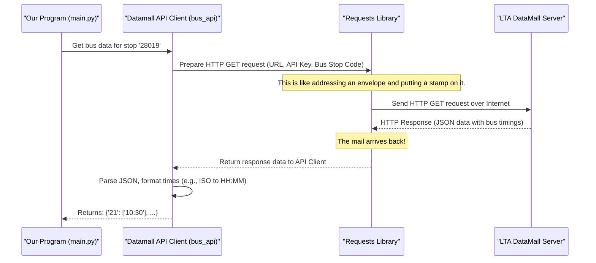

# Chapter 4: Datamall API Client

Welcome to Chapter 4! In the [previous chapter](03_continuous_update_orchestrator_.md), we saw how the [Continuous Update Orchestrator](03_continuous_update_orchestrator_.md) is responsible for repeatedly fetching fresh bus data to keep our display up-to-date. But *how* does it actually get this data from the internet? That's where our **Datamall API Client** comes into play!

## What's a Datamall API Client?

Imagine you want to order your favorite pizza, but you can't go to the restaurant yourself. You might use a food delivery app.
*   You tell the app: "I want a large pepperoni pizza delivered to this address."
*   The app (your messenger) takes your request, contacts the restaurant, places the order correctly, and handles the payment details.
*   Eventually, the pizza (your data) arrives!

The **Datamall API Client** in our project is very much like that food delivery app. Its one and only job is to communicate with an external service called **LTA DataMall**. LTA DataMall is an official source of transportation data in Singapore, including live bus arrival times.

Our main program needs bus arrival times for a specific bus stop. The Datamall API Client's role is to:
1.  Take a bus stop code from our main program.
2.  Connect to the LTA DataMall over the internet.
3.  Send a request for bus arrival times at that bus stop, using a special "password" called an API key.
4.  Receive the raw data back from LTA DataMall.
5.  Do a little bit of initial tidying up of this data.

It acts as a specialized messenger, shielding the rest of our program from the nitty-gritty details of how to talk to the LTA DataMall. This is great because if LTA DataMall changes some minor details about how to request data, we only need to update our "messenger" (the Datamall API Client), not the entire program.

The problem it solves is: **How do we reliably fetch live bus arrival information from the LTA DataMall service?**

## Key Things the Client Handles

*   **API (Application Programming Interface):** Think of an API as a menu at a restaurant. It lists what you can order (what data you can request) and how to order it (how to format your request). LTA DataMall provides an API for developers like us to access their data.
*   **API Key:** This is like a secret password or a membership card. LTA DataMall gives out API keys to registered users. Our program needs to present this key with every request to prove it's allowed to access the data.
*   **Network Request:** This is the act of sending a message (our request for bus data) over the internet to LTA DataMall's computers (servers) and waiting for their response.

## How Our Program Uses the Datamall API Client

In our `main.py` file, the [Continuous Update Orchestrator](03_continuous_update_orchestrator_.md) uses the Datamall API Client like this:

**1. Setting up the Client (Initialization):**
First, we need to create our "messenger." This happens once when our program starts.

```python
# In main.py, inside the main() function
# This line creates our DatamallApiClient object
bus_api = DatamallApiClient()
```
*   `DatamallApiClient()`: This creates an instance (a working copy) of our client. We store it in the variable `bus_api`.
*   When this client is created, it expects to find your unique LTA DataMall API key. We'll see how it gets this key a bit later.

**2. Asking for Bus Data:**
Once the `bus_api` object is ready, the orchestrator can use it to ask for data whenever needed.

```python
# In main.py, inside the while True loop
BUS_STOP_CODE = "28019" # Example bus stop
buses = bus_api.bus_at_busstop_code(BUS_STOP_CODE)
```
*   `bus_api.bus_at_busstop_code(BUS_STOP_CODE)`: This is the command to our messenger. We're saying, "Go get all bus arrival times for bus stop `BUS_STOP_CODE`."
*   **Input:** The `BUS_STOP_CODE` (e.g., "28019").
*   **Output (what `buses` might look like):** The client returns a dictionary. The keys are bus service numbers (as strings), and the values are lists of estimated arrival times (as strings in "HH:MM" format). For example:
    ```
    {'21': ['10:30', '10:45', '11:02'], 
     '168': ['10:35', '10:55']}
    ```
    This is the "raw-ish" data. It's not yet in the "3 min", "10 min" format we show on the LCD. That conversion happens later, in the [API Response Processor](05_api_response_processor_.md).

Our main program doesn't need to know the LTA DataMall's website address, or how to format the request, or even where the API key is stored. It just calls `bus_api.bus_at_busstop_code()`. Simple!

## Under the Hood: What Happens When We Ask for Data?

Let's peek behind the curtain. When `bus_api.bus_at_busstop_code("28019")` is called, the `DatamallApiClient` (defined in `sg_bus_api.py`) performs several steps:

1.  **Prepares the Request:** It knows the specific web address (URL or "endpoint") for LTA DataMall's bus arrival service.
2.  **Adds Your API Key:** It takes your secret API key and includes it in the request. This is usually done in something called "headers."
3.  **Includes the Bus Stop Code:** It adds the `BUS_STOP_CODE` (e.g., "28019") to the request, usually as a "parameter."
4.  **Sends the Request:** It uses a Python library called `requests` to send this fully formed request over the internet to the LTA DataMall server.
5.  **Receives the Response:** LTA DataMall processes the request. If everything is okay (valid API key, valid bus stop code), it sends back the bus arrival data. This data is typically in a format called JSON, which is easy for programs to understand.
6.  **Parses and Formats:** The client receives this JSON data. It then extracts the useful bits: the bus service numbers and their estimated arrival times. It also converts the arrival times from a complex timestamp format (like "2020-02-29T22:37:16+08:00") into a simpler "HH:MM" format (like "22:37").

Here's a simplified diagram of this communication:



## A Closer Look at the Code (`sg_bus_api.py`)

The `DatamallApiClient` is defined in a file named `sg_bus_api.py`. Let's look at its key parts.

### 1. Initialization (`__init__`) - Getting Ready

When we create the client with `bus_api = DatamallApiClient()`, the `__init__` method runs:

```python
# From sg_bus_api.py
import os # For accessing environment variables
# ... other imports ...

BASE_EP = 'http://datamall2.mytransport.sg' # LTA DataMall base URL

class DatamallApiClient(object):
    def __init__(self):
        if 'DATAMALL_API_KEY' not in os.environ:
            raise Exception("DATAMALL_API_KEY not set.") # Simplified error
        
        self.api_key = os.environ['DATAMALL_API_KEY']
        self.base_ep = BASE_EP
        self.default_headers = {
            'AccountKey': self.api_key, # Your API key!
            'accept': 'application/json' # We want data in JSON format
        }
```
*   `os.environ['DATAMALL_API_KEY']`: This line tries to get your LTA DataMall API key. It looks for something called an **environment variable** named `DATAMALL_API_KEY`.
    *   **What's an Environment Variable?** Think of it as a setting stored outside your program, in the computer's operating system. It's a common and secure way to store sensitive information like API keys, so you don't have to type them directly into your code (which is risky if you share your code). The project setup guide will explain how to set this variable.
*   If the API key isn't found, the program stops with an error.
*   `self.default_headers`: This prepares a standard set of "headers" that will be sent with every request. The most important parts are your `AccountKey` (the API key) and `accept: application/json` (telling LTA DataMall we prefer data in JSON format).

### 2. Fetching Data (`bus_at_busstop_code`) - The Main Job

This is the method our `main.py` calls:

```python
# From sg_bus_api.py (inside DatamallApiClient class)
    def bus_at_busstop_code(self, busstop_code):
        # The actual web address for bus arrivals
        api_endpoint = self.base_ep + '/ltaodataservice/BusArrivalv2'
        
        # Parameters for the request (the bus stop we're interested in)
        params = {'BusStopCode': busstop_code}
        
        # Make the internet call!
        res = requests.get(api_endpoint, 
                           headers=self.default_headers, 
                           params=params)
        # ... (processing the response comes next) ...
```
*   `api_endpoint`: Combines the base URL (`http://datamall2.mytransport.sg`) with the specific path for bus arrivals (`/ltaodataservice/BusArrivalv2`).
*   `params = {'BusStopCode': busstop_code}`: This dictionary specifies the query parameters for the request. Here, we're asking for data related to a particular `BusStopCode`.
*   `requests.get(...)`: This is the magic line! It uses the `requests` library (a popular Python tool for making web requests) to send a `GET` request to the `api_endpoint`. It includes our `default_headers` (with the API key) and the `params` (with the bus stop code). The response from LTA DataMall is stored in the `res` variable.

After getting the response (`res`), the code checks if the request was successful and then processes the data:

```python
# Continuing in bus_at_busstop_code method...
        buses_info = {} # To store our results
        if res.status_code == 200: # 200 means "OK", success!
            # The actual data is in JSON format
            data = res.json() 
            for bus_service in data['Services']:
                service_no = bus_service['ServiceNo']
                buses_info[service_no] = [] # List for this bus's timings
                
                # LTA provides up to 3 next bus timings
                # We check each one and format it
                if bus_service['NextBus']['EstimatedArrival']:
                    # self.iso_time_to_hhmm converts complex time to "HH:MM"
                    arrival_time = self.iso_time_to_hhmm(
                        bus_service['NextBus']['EstimatedArrival'])
                    buses_info[service_no].append(arrival_time)
                
                # Similar checks for 'NextBus2' and 'NextBus3'
                if bus_service['NextBus2']['EstimatedArrival']:
                    # ... append formatted time ...
                    pass # Simplified for brevity
                if bus_service['NextBus3']['EstimatedArrival']:
                    # ... append formatted time ...
                    pass # Simplified for brevity
        return buses_info
```
*   `res.status_code == 200`: HTTP status code 200 means the request was successful. If it's something else (like 401 for "Unauthorized" or 404 for "Not Found"), it means there was a problem.
*   `data = res.json()`: Converts the JSON response from LTA DataMall into a Python dictionary that we can easily work with.
*   The code then loops through each `bus_service` provided in the data.
*   For each service, it extracts `ServiceNo` (like "21") and up to three `EstimatedArrival` times (`NextBus`, `NextBus2`, `NextBus3`).
*   `self.iso_time_to_hhmm(...)`: This helper method (explained below) is called to convert the LTA's detailed timestamp into a simple "HH:MM" string.
*   Finally, it returns the `buses_info` dictionary, like `{'21': ['22:37', '22:45'], ...}`.

### 3. Formatting Time (`iso_time_to_hhmm`) - A Little Helper

LTA DataMall provides times in a very precise format called ISO 8601 (e.g., `2020-02-29T22:37:16+08:00`). This helper method converts it to something more readable for our initial processing:

```python
# From sg_bus_api.py (inside DatamallApiClient class)
    def iso_time_to_hhmm(self, iso_timestamp_string):
        # Uses libraries to parse the complex timestamp
        utctime = dateutil.parser.parse(iso_timestamp_string)
        # Converts it to Singapore local time
        localtime = utctime.astimezone(pytz.timezone("Asia/Singapore"))
        # Formats it as "Hour:Minute"
        return localtime.strftime('%H:%M')
```
*   This method uses external libraries `dateutil.parser` (to understand the complex ISO string) and `pytz` (to handle timezones correctly, ensuring we show Singapore time).
*   `localtime.strftime('%H:%M')` formats the time into a "HH:MM" string (e.g., "22:37").

## Summary and What's Next

The **Datamall API Client** is our dedicated messenger to the LTA DataMall. It handles all the complexities of:
*   Using your secret API key.
*   Forming the correct internet request for a given bus stop code.
*   Sending the request and receiving the response.
*   Doing some initial parsing and formatting of the raw data (like time conversion).

It provides a simple function (`bus_at_busstop_code`) for the rest of our program to use, making it easy to get the bus arrival data we need.

Now that we have this "raw-ish" data (bus numbers and their arrival times as "HH:MM"), how do we convert these absolute times into user-friendly relative times like "3 min", "10 min", or "ARR" (Arriving)? That's the job of the [API Response Processor](05_api_response_processor_.md), which we'll explore in the next chapter!

---

Generated by [AI Codebase Knowledge Builder](https://github.com/The-Pocket/Tutorial-Codebase-Knowledge)