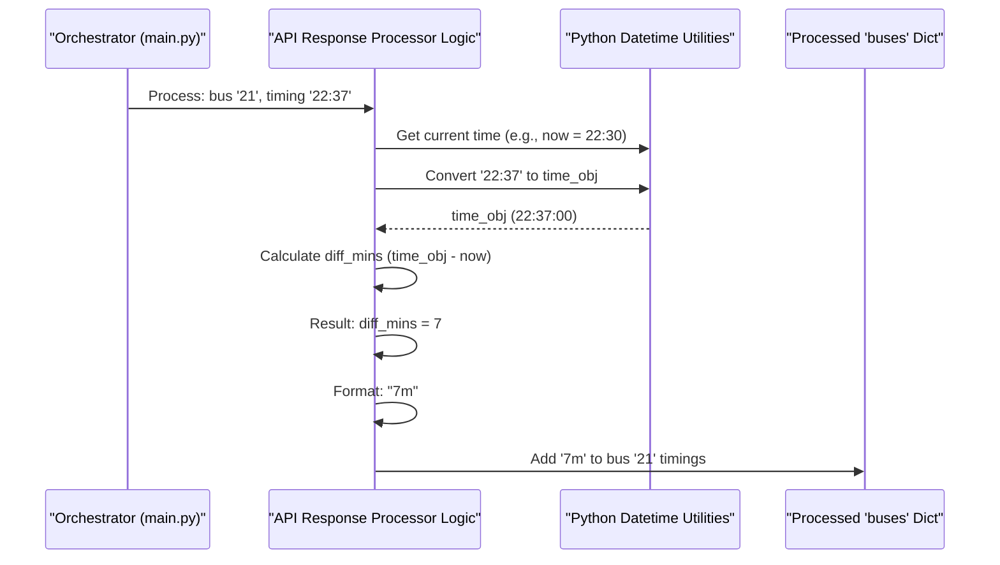

# Chapter 5: API Response Processor

Welcome to Chapter 5, the final chapter in our journey through the `raspberry-pi-bus-timing-in-lcd` project! In [Chapter 4: Datamall API Client](04_datamall_api_client_.md), we learned how our program acts like a messenger, fetching bus arrival data from the LTA DataMall. That client did a great job of getting the raw information and even converting complex timestamps like '2020-02-29T22:37:16+08:00' into a simpler "HH:MM" format, such as "22:37".

But "22:37" is still an absolute time. If it's currently "22:30", wouldn't it be much friendlier to see "7 min" on our display? That's exactly what the **API Response Processor** helps us achieve!

## What's an API Response Processor?

Imagine the [Datamall API Client](04_datamall_api_client_.md) is like a grocery shopper who has brought back ingredients – specifically, bus numbers and their arrival times in "HH:MM" format (e.g., Bus 21 arrives at "22:37", "22:45").

The **API Response Processor** is like a skilled chef. This chef takes these "HH:MM" ingredients and prepares them into a dish that's much easier for us to digest. It:
1.  Looks at the current time.
2.  Compares the current time with each bus's "HH:MM" arrival time.
3.  Calculates the difference in minutes.
4.  Formats this difference into a very human-readable string like "5 min", "12 min", or "ARR" (if the bus is arriving very soon).

So, if the [Datamall API Client](04_datamall_api_client_.md) provides data like:
`{'21': ['22:37', '22:45'], '168': ['22:32']}`

And the current time is "22:30", the API Response Processor will transform it into something like:
`{'21': ['7m', '15m'], '168': ['2m']}`

This processed data is then ready for the [LCD Data Presenter](01_lcd_data_presenter_.md) to format and display.

The main problem this processor solves is: **How do we convert absolute bus arrival times (like "22:37") into easy-to-understand relative times (like "7 min")?**

## The Goal: From "HH:MM" to "Minutes Away"

Let's be clear about the transformation:

*   **Input (from Datamall API Client):** A dictionary where keys are bus service numbers (strings) and values are lists of arrival times as "HH:MM" strings.
    Example: `{'969': ['14:05', '14:15'], '123': ['14:02']}`

*   **Output (ready for LCD Data Presenter):** A dictionary with the same structure, but the arrival times are now relative strings (e.g., "Xm" for X minutes, or "ARR" for arriving).
    Example (if current time is 14:00): `{'969': ['5m', '15m'], '123': ['2m']}`

## How It Works: The Calculation Steps

The logic for this processing isn't in a separate file but is part of our main `main.py` script, specifically within the [Continuous Update Orchestrator](03_continuous_update_orchestrator_.md)'s main loop. Here's the step-by-step thinking:

1.  **Get Current Time:** First, we need to know what time it is *right now*.
2.  **Iterate Through Buses:** Go through each bus service provided by the [Datamall API Client](04_datamall_api_client_.md).
3.  **Iterate Through Timings:** For each bus, go through its list of "HH:MM" arrival times.
4.  **Convert and Compare:** For each "HH:MM" arrival time:
    a.  Convert the "HH:MM" string (e.g., "14:05") into a time format that Python can understand and compare.
    b.  Calculate the difference in minutes between this arrival time and the current time.
5.  **Format the Output:**
    a.  If the difference is 0 or 1 minute, display "ARR" (for "Arriving").
    b.  If the difference is greater than 1 minute, display it as "Xm" (e.g., "5m").
    c.  If the bus has already passed (negative difference), it's often best to simply not show that timing or handle it gracefully (our current project's code usually filters these out or the API doesn't provide past times for "NextBus").
6.  **Store Processed Timings:** Collect these newly formatted relative times.

## The Code in Action: Processing in `main.py`

Let's look at how this logic is implemented in `main.py`. After the `bus_api.bus_at_busstop_code(BUS_STOP_CODE)` call (which gets us the "HH:MM" times from the [Datamall API Client](04_datamall_api_client_.md)), the processing begins:

```python
# Inside main.py, within the while True loop:
# buses_api_response is like {'21': ['22:37', '22:45'], ...}
buses_api_response = bus_api.bus_at_busstop_code(BUS_STOP_CODE)

buses = {} # This will store our human-readable processed timings

# Get the current time ONCE for this batch of processing
now = datetime.now().time() # e.g., datetime.time(22, 30, 0)

for bus_num, bus_timings_api in buses_api_response.items():
    processed_timings_for_this_bus = []
    for api_timing_str in bus_timings_api: # e.g., api_timing_str is "22:37"
        # ... calculation logic comes next ...
```
*   `buses_api_response`: This holds the data from the [Datamall API Client](04_datamall_api_client_.md) (e.g., `{'21': ['22:37', '22:45']}`).
*   `buses = {}`: An empty dictionary that will soon be filled with our processed data (e.g., `{'21': ['7m', '15m']}`).
*   `now = datetime.now().time()`: This gets the current time (hours, minutes, seconds). We get it once before the loops to ensure all calculations in this cycle use the same "current time" reference.
*   The code then loops through each `bus_num` and its `bus_timings_api` (list of "HH:MM" strings).

Now, let's focus on processing a single `api_timing_str` (like "22:37"):

```python
        # Convert the "HH:MM" string to a Python time object
        # For example, "22:37" becomes datetime.time(22, 37)
        bus_arrival_time_obj = datetime.strptime(api_timing_str, '%H:%M').time()

        # Calculate the difference in minutes
        # This needs a bit of care because time objects don't directly subtract to minutes
        # We convert both to seconds from midnight for easier calculation
        now_seconds = now.hour * 3600 + now.minute * 60 + now.second
        arrival_seconds = bus_arrival_time_obj.hour * 3600 + \
                          bus_arrival_time_obj.minute * 60
        
        diff_seconds = arrival_seconds - now_seconds
        diff_mins = diff_seconds // 60 # Integer division for whole minutes
```
*   `datetime.strptime(api_timing_str, '%H:%M').time()`: This is key!
    *   `strptime` means "string parse time". It takes the `api_timing_str` (e.g., "22:37") and the format `'%H:%M'` (Hour:Minute) and converts it into a Python `datetime` object.
    *   `.time()` then extracts just the time part from that `datetime` object.
*   To calculate `diff_mins`, we convert both the current time (`now`) and the bus arrival time (`bus_arrival_time_obj`) into total seconds past midnight. This makes subtraction straightforward.
*   `diff_mins = diff_seconds // 60`: We divide the difference in seconds by 60 to get minutes. The `//` ensures we get a whole number (integer division).

Finally, we format this `diff_mins` into our desired string:

```python
        display_timing_str = ''
        if diff_mins < 0: # Bus likely passed or time is slightly off
            display_timing_str = "..." # Or skip, or show "NA"
            # In our project, often these are just not added or API doesn't give past times.
            # For simplicity, we'll assume diff_mins will be >= 0 for valid upcoming buses.
        elif diff_mins <= 1: # Arriving in 0 or 1 minute
            display_timing_str = "ARR"
        else: # Arriving in more than 1 minute
            display_timing_str = f"{diff_mins}m" # e.g., "7m"
        
        processed_timings_for_this_bus.append(display_timing_str)
    
    # After processing all timings for one bus service:
    if processed_timings_for_this_bus: # Only add if there are valid timings
        buses[bus_num] = processed_timings_for_this_bus
```
*   If `diff_mins` is less than 0, the bus might have already passed. The provided code usually doesn't add these.
*   If `diff_mins` is 0 or 1, we set the string to "ARR".
*   Otherwise, we use an f-string `f"{diff_mins}m"` to create strings like "7m", "15m", etc.
*   This `display_timing_str` is added to `processed_timings_for_this_bus`.
*   Finally, the `buses` dictionary is updated with the `bus_num` and its list of processed, human-readable timings.

This `buses` dictionary (e.g., `{'21': ['7m', '15m'], '168': ['2m']}`) is then passed to the [LCD Data Presenter](01_lcd_data_presenter_.md) logic, which we covered in Chapter 1.

## Visualizing the Process

Here's a simplified flow of how the API Response Processor works for one bus arrival time:



## Summary: The Final Polish

The **API Response Processor** is the component that adds the final layer of user-friendliness to our bus arrival data. It transforms the "HH:MM" times (which the [Datamall API Client](04_datamall_api_client_.md) worked hard to get for us) into relative times like "7m" or "ARR". This makes the information displayed on our LCD much more intuitive and quick to understand.

This logic, embedded within `main.py`, ensures that the [LCD Data Presenter](01_lcd_data_presenter_.md) receives data in the exact format it needs to create those clear, concise messages for our little screen.

## Project Wrap-up: All Pieces Together!

And with that, we've explored all the major conceptual components of our `raspberry-pi-bus-timing-in-lcd` project! Let's quickly recap how they work together:

1.  The **[Continuous Update Orchestrator](03_continuous_update_orchestrator_.md)** (the main loop in `main.py`) is the conductor. It decides it's time for an update.
2.  It calls the **[Datamall API Client](04_datamall_api_client_.md)** (`sg_bus_api.py`). This client connects to the LTA DataMall, fetches raw bus arrival data using your API key, and does an initial conversion of complex timestamps into "HH:MM" format.
3.  The orchestrator then takes this "HH:MM" data and uses the **API Response Processor** logic (also in `main.py`) to convert these absolute times into relative, human-friendly strings like "5m" or "ARR", based on the current time.
4.  This processed, human-friendly data is then handed to the **[LCD Data Presenter](01_lcd_data_presenter_.md)** logic (in `main.py`). The presenter formats this information specifically for our 16x2 LCD, deciding what text goes on line 1 and line 2.
5.  Finally, the presenter uses the **[Physical Display Interface](02_physical_display_interface_.md)** (the `lcd` object initialized from `RPLCD.CharLCD`) to send the formatted strings to the actual LCD hardware, making the text appear!

This entire cycle repeats, keeping your bus arrival information fresh and visible.

Congratulations on making it through all five chapters! You now have a solid understanding of how each part of the `raspberry-pi-bus-timing-in-lcd` project contributes to its goal. Hopefully, this makes the code easier to understand, modify, and even build upon for your own exciting projects! Happy tinkering!

---

Generated by [AI Codebase Knowledge Builder](https://github.com/The-Pocket/Tutorial-Codebase-Knowledge)