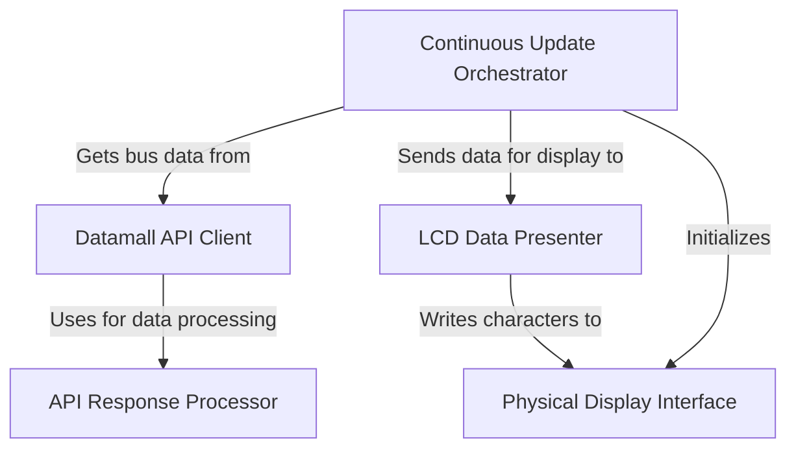

# Tutorial is generated by using PocketFlow AI: [https://github.com/The-Pocket/PocketFlow-Template-Python](https://github.com/The-Pocket/PocketFlow-Template-Python)
## Tutorial: raspberry-pi-bus-timing-in-lcd

This project creates a *bus arrival timing display* for a Raspberry Pi.
It uses a **physical LCD screen** to show *up-to-date bus information* for a specific bus stop.
The system fetches data from Singapore's **LTA DataMall API**, processes it, and continuously updates the LCD with the arrival times.

**Source Repository:** [https://github.com/tryorfry/raspberry-pi-bus-timing-in-lcd](https://github.com/tryorfry/raspberry-pi-bus-timing-in-lcd)

## Chapters

1. [LCD Data Presenter
](01_lcd_data_presenter_.md)
2. [Physical Display Interface
](02_physical_display_interface_.md)
3. [Continuous Update Orchestrator
](03_continuous_update_orchestrator_.md)
4. [Datamall API Client
](04_datamall_api_client_.md)
5. [API Response Processor
](05_api_response_processor_.md)

---

Generated by [AI Codebase Knowledge Builder](https://github.com/The-Pocket/Tutorial-Codebase-Knowledge)